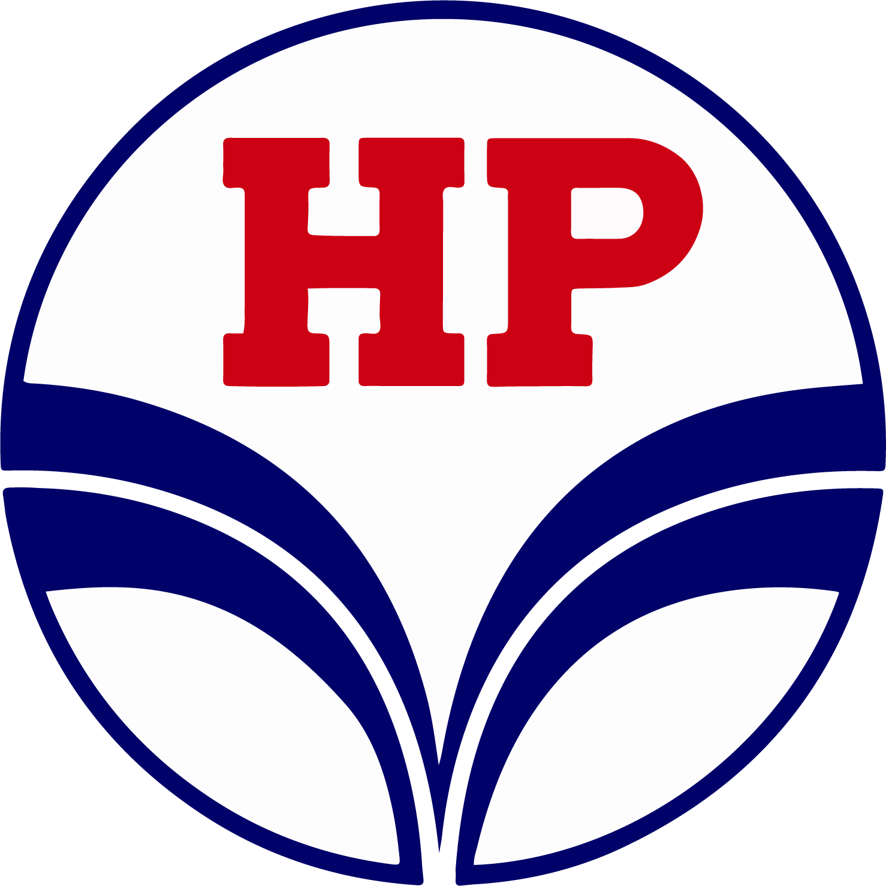
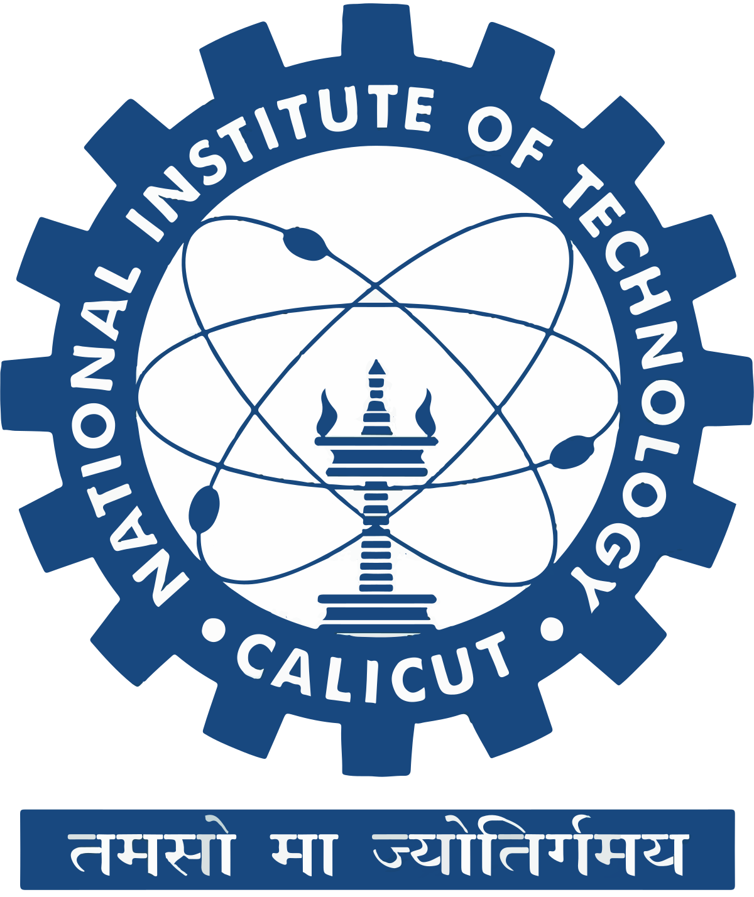
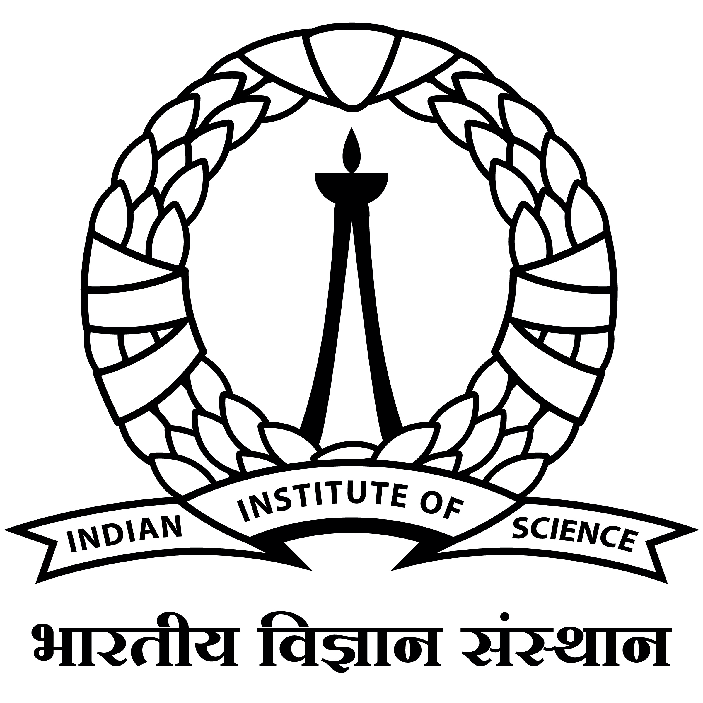

# Vasanth S. Bhaskara
**Data Scientist @ ZS** | **Databricks Certified Data Engineer** | **Dept Rank 3 – NIT Calicut Alumni** | **IISc Summer Research Fellow** | **160+ LeetCode Problems Solved**

---

## Professional Summary

I bring a strong foundation in **Mathematics, Computational Skills, Engineering, and Business Acumen**, developed during my undergraduate studies at NIT Calicut and refined through professional experience at leading organizations.

Currently working at **ZS**, a premier global consulting firm specializing in data-driven solutions for the pharmaceutical and healthcare industry. I solve high-impact business problems in the **Digital Customer Experience space**, leveraging **Marketing Mix Modeling** with statistical analysis, advanced feature engineering (ad stocking horizons, log transformations), and regression modeling to help top pharma and life sciences clients make strategic, data-informed decisions.

Previously, at **HPCL**—one of India's largest Oil Marketing Companies—I worked as a **Condition Monitoring Engineer** at the Visakh Refinery, where I implemented AI-driven predictive maintenance tools to reduce downtime, built dashboards for maintenance compliance tracking, and managed procurement activities across the oil business value chain.

I recently passed the **Databricks Certified Data Engineer Associate** exam and have developed deep expertise in Apache Spark, Delta Lake, and distributed computing architectures for scalable data pipelines.

<i class="fas fa-envelope email-link" id="emailicon-high">&nbsp;:&nbsp;&nbsp;</i> 
<code style="color: #000000; background: #ffffff; display: inline-block;">vasanthsbhaskara [at] gmail [dot] com</code>

---

## 🚀 About Databricks Certification

I've been diving into Databricks over the past few months, and it's been absolutely fascinating:

- **Big Data Architecture**: Distributed computing enables us to build truly scalable systems across cloud platforms
- **Apache Spark Evolution**: Moving beyond traditional Hadoop MapReduce with much faster, in-memory computation models
- **Modern Data Pipelines**: Spark's ecosystem (Spark Streaming, Structured Streaming, Kafka integrations) shows how data infrastructure has evolved
- **Spark Architecture**: Driver–worker architecture where the driver coordinates job execution, with lazy execution building optimized Directed Acyclic Graphs (DAGs)
- **Delta Lake Storage**: ACID transactions, schema enforcement, time travel, and versioning combining Parquet files with transaction logs
- **Performance Optimization**: OPTIMIZE, ZORDER BY, PARTITION BY, and Auto Liquid Clustering for query acceleration
- **Cost Optimization**: Comparing job clusters, all-purpose compute, serverless options, and spot instances
- **End-to-End Pipelines**: Built ETL pipelines using PySpark following the Medallion Architecture (Bronze → Silver → Gold) with Delta Live Tables

Databricks truly brings together the best of data engineering, scalability, and reliability in one unified platform.

---

## 💼 Experience

### Data Analyst @ ZS
**Feb 2025 - Present** | Pune, Maharashtra, India

|  | **Role:** Data Scientist, Digital Customer Experience |
|---|---|

- **Marketing Mix Modeling**: Conducted comprehensive MMM for a leading global pharmaceutical portfolio, supporting omnichannel strategy optimization across oncology, immunology, and neuroscience products
- **Advanced Feature Engineering**: Engineered sophisticated features (adstocking, normalization, log transforms) and built linear/Bayesian regression models in Python to maximize predictive accuracy
- **Data Processing & EDA**: Performed large-scale data preprocessing and exploratory data analysis using Pandas, including cleaning, transformation, and aggregation-based summarization
- **Patient Analytics**: Analyzed Patient Level Data (PLD) to identify key drivers of referrals, accounting for carryover effects and salesforce activity patterns
- **Case Competition Winner**: Won 1st place in ZS's internal case competition by applying t-SNE and K-Means clustering to segment Healthcare Professionals (HCPs) and design targeted engagement strategies

---

### Condition Monitoring Engineer @ Hindustan Petroleum Corporation Limited (HPCL)
**Aug 2024 - Jan 2025** | Visakhapatnam, Andhra Pradesh, India

|  | **Role:** Predictive Maintenance & Planning |
|---|---|

**Condition Monitoring Activities:**
- Conducted vibration monitoring of rotary equipment using Emerson CSI 2140 Analyzer
- Proficient in predictive maintenance software: Honeywell Forge Asset Performance Management, Bently Nevada System 1, Howden Uptime, and AMS Vibration Monitoring
- Hands-on experience monitoring pumps, centrifugal & reciprocating compressors, blowers, Gas Turbines, Air Fin Cooler Fans, and Cooling Tower fans
- Utilized SAP MM and PM modules for work permits and led safety compliance for 20+ data collectors
- Delivered external presentations on predictive maintenance strategies, showcasing in-house implementation success stories

**Planning & Optimization Activities:**
- Spearheaded firewall procurement via competitive tendering, managing six vendors with annual turnovers exceeding ₹4 billion
- Designed greasing schedules for 2,300+ machines using tribology principles, enhancing preventive maintenance strategies and reducing unplanned downtime
- Built real-time greasing compliance dashboard in Excel, improving adherence to maintenance schedules and minimizing equipment failure rates

---

## Education
<table>
  <tbody>
    <tr>
      <td rowspan="3" style="text-align: center; vertical-align: top;"></td>
      <td style="text-align: left; vertical-align: top;"><strong>B.Tech. in Mechanical Engineering</strong></td>
      <td></td>
    </tr>
    <tr>
      <td style="text-align: left; vertical-align: top;"><strong><a href="https://www.nitc.ac.in/">National Institute of Technology (NIT), Calicut</a></strong></td>
      <td>&nbsp;</td>
      <td style="text-align: right; vertical-align: top;">Dec 2020 - May 2024</td>
    </tr>
    <tr>
      <td style="text-align: left; vertical-align: top;">Cumulative Grade Point Average: 9.25 / 10.0 | <strong>Department Rank: 3 out of 210</strong></td>
      <td></td>
      <td></td>
    </tr>
  </tbody>
</table>

- **Project Title**: Design, Fabrication, and Control of a Multipurpose Marine Robot
- **Project Advisor**: [Dr. Sudheer A P](https://nitc.ac.in/department/mechanical-engineering/faculty-and-staff/faculty/8eb95fa4-0e19-4246-aa46-75095a3ec8d8), Associate Professor, National Institute of Technology (NIT) Calicut
- **Funding**: Secured a Grant of Rs. 75,000 from the Centre for Innovation, Entrepreneurship and Incubation (CIEI) at NIT Calicut
  - Led a team of three students as Project Lead, providing direction to meet project milestones and strict deadlines
  - Managed fund allocations and budgeting throughout the project lifecycle
  - Executed complete CAD design, CFD analysis, and fabrication strategies
  - Presented project findings and addressed evaluation committee questions

---

## Research Experience
<table>
  <tbody>
    <tr>
      <td rowspan="3" style="text-align: center; vertical-align: top;"></td>
      <td style="text-align: left; vertical-align: top;"><strong>Indian Academy of Sciences (IAS), Summer Research Fellow</strong></td>
      <td></td>
    </tr>
    <tr>
      <td style="text-align: left; vertical-align: top;"><strong><a href="https://iisc.ac.in">Indian Institute of Science (IISc), Bengaluru</a></strong></td>
      <td>&nbsp;</td>
      <td style="text-align: right; vertical-align: top;">May 2023 - June 2023</td>
    </tr>
    <tr>
      <td style="text-align: left; vertical-align: top;">Droplet Dynamics on Heated Substrates, Guide: <a href="https://mecheng.iisc.ac.in/people/susmita-dash/" target="_blank">Dr. Susmita Dash</a></td>
      <td></td>
      <td></td>
    </tr>
  </tbody>
</table>

- Conducted experiments involving water droplets on a hot pillared surface and captured dynamics using high-speed cameras
- Conducted image processing in Python using OpenCV on the clip of a Leidenfrost droplet
- Gained proficiency in the principles of image processing algorithms: Gaussian Blur, Canny Detector, Thresholding, and Contouring
- Quantified the effect of an increase in heat transfer from the pillars to the droplet with pillar height, by modelling the system as fins

## Achievements & Academic Honors

- **Recipient of the prestigious IASc-INSA-NASI Summer Research Fellowship (Mar 2023)**: Selected for the highly competitive Indian Academy of Sciences Fellowship, one of the most prestigious fellowships in India, and worked under Dr. Susmita Dash at IISc Bengaluru
- **Department Rank 3 out of 210**: Secured 9.25 / 10.0 CGPA in Mechanical Engineering, with 83% of courses graded at 9.0 or above
- **Selected for Summer Fellowship programs at IIT Madras and IIT Kanpur (May 2023)**
- **Perfect Grade (10/10) in all Mathematics Courses**: Only student in department awarded this distinction
- **Department Rank 1 in 4th Semester (June 2022)**: Achieved SGPA of 9.58 / 10.0 among 210 students

## Academic Projects

### Top 3 teams in Kaggle Insurance Claim Challenge (Dec 2023)
- Engineered features and built XGBoost models achieving 73% accuracy on claim predictions
- Applied data preprocessing and feature engineering techniques

### Monté Carlo Simulation for Fuel Cell Efficiency (April 2023)
- Developed probabilistic simulation in Python to estimate real fuel cell efficiency under variable distributions

### Transportation Logistics Optimization (March 2023)
- Applied linear programming to warehouse allocation problem, achieving cost-effective distribution across six hostels

## Relevant Coursework

### Courses with Perfect Grade
- Computer Programming, Machine Learning for Data Science and Analytics, Introduction to Robotics

### Online Courses
- Machine Learning offered by Andrew Ng (Coursera), CS50: Introduction to Computer Science (edX)

---

## 🏆 Licenses & Certifications

### Databricks Certified Data Engineer Associate
|  | **Databricks** |
|---|---|
| **Issued:** November 2025 | **Expires:** November 2027 |
| **Credential ID:** 166205453 | **Skills:** SQL, PySpark, Spark SQL |
| [View Credential](#) | |

---

### Advanced Learning Algorithms
|  | **DeepLearning.AI** |
|---|---|
| **Issued:** July 2025 | **Skills:** Deep Learning · Neural Networks · TensorFlow · Text Classification · Performance Tuning · Decision Trees · Gradient Boosting · Random Forest · XGBoost |
| **Credential ID:** AS6WZ79ABLIF | [View Credential](#) |

---

### Supervised Machine Learning: Regression and Classification
|  | **DeepLearning.AI** |
|---|---|
| **Issued:** April 2024 | **Skills:** Machine Learning · Classification · Machine Learning Algorithms |
| [View Credential](#) | |

---

### Python (Basic) Certification
|  | **HackerRank** |
|---|---|
| **Issued:** October 2023 | **Credential ID:** 32E7780D782E |
| **Skills:** Python (Programming Language) | [View Credential](#) |

---

### SQL (Basic) Certification
|  | **HackerRank** |
|---|---|
| **Issued:** October 2023 | **Credential ID:** D45E82C5C8B8 |
| **Skills:** SQL | [View Credential](#) |

---

## Skills

- **Languages**: Python (Proficient), C/C++ (Intermediate)
- **Tech Stack**: Data Structures and Algorithms (Proficient), SQL (Beginner)
- **Python Libraries**: NumPy, Pandas, Scikit-learn, OpenCV, Matplotlib, Jupyter Notebook
- **Big Data & Cloud**: Apache Spark, PySpark, Delta Lake, Databricks, SQL
- **Machine Learning**: Supervised Learning, Regression, Classification, XGBoost, Deep Learning, TensorFlow
- **Tools & IDEs**: VS Code, Jupyter Notebook, Sublime Text, Excel, SAP (MM/PM modules)
- **Business Tools**: Marketing Mix Modeling, Feature Engineering, Statistical Analysis, Data Visualization