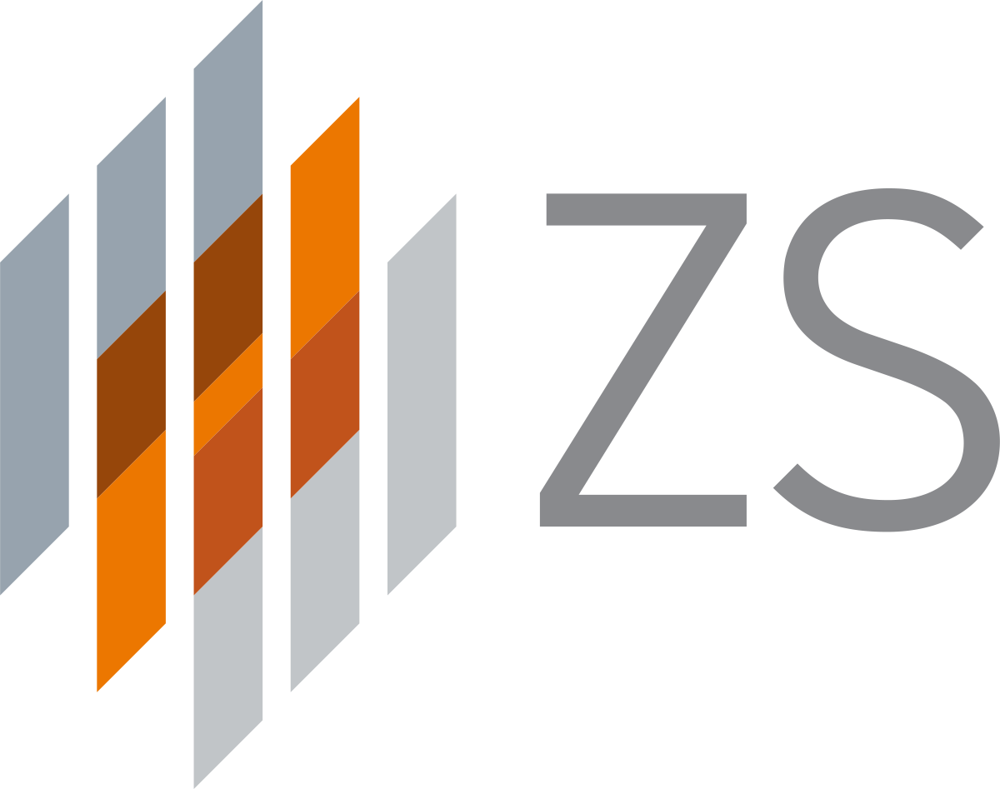

<table>
  <tbody>
    <tr>
      <td rowspan="4" style="vertical-align: top;">
        I bring a strong foundation in <strong>Mathematics, Computational Skills, Engineering, and Business Acumen</strong>, developed during my undergraduate studies at NIT Calicut and refined through professional experience at leading organizations.  
        Currently, I work at <a href="https://www.zs.com/">ZS</a>, where I solve high-impact business problems in the digital customer experience space for pharmaceutical and healthcare clients. My work spans marketing mix modeling, feature engineering, regression modeling, and patient-level analytics to support strategic decisions with data.  
        Before that, I worked at <a href="https://www.hindustanpetroleum.com/">Hindustan Petroleum</a> as a Condition Monitoring Engineer at the Visakh Refinery. I built AI-driven predictive maintenance tools, maintenance dashboards, and supported procurement operations across the oil and gas value chain.  
        I recently earned the <strong>Databricks Certified Data Engineer Associate</strong> certification, and I work extensively with Spark, Delta Lake, Python, SQL, and large-scale data workflows.
      </td>
      <td>&nbsp;&nbsp;&nbsp;</td>
      <td rowspan="3" style="text-align: right;">
          
        
      </td>
    </tr>
    <tr>
      <td></td>
      <td></td>
    </tr>
    <tr>
      <td></td>
      <td></td>
    </tr>
    <tr>
      <td></td>
      <td style="text-align: right;"></td>
    </tr>
  </tbody>
</table>

  

    <strong class="news-badge">★ NEWS</strong>
  

  <ul class="news-list">
    <li><strong>Nov 2025</strong> - Passed the Databricks Certified Data Engineer Associate exam.</li>
    <li><strong>Feb 2025</strong> - Joined ZS as a Data Analyst in Pune.</li>
  </ul>

<strong>Contact</strong>: <code style="color: #000000; background: #ffffff;"><strong>vasanthsbhaskara [at] gmail [dot] com</strong></code>

## Experience

<table>
  <tbody>
    <tr>
      <td style="text-align: left; vertical-align: top;"><strong>Data Analyst</strong></td>
      <td rowspan="4" style="text-align: center;"></td>
      <td></td>
    </tr>
    <tr>
      <td style="text-align: left; vertical-align: top;"><strong><a href="https://www.zs.com/">ZS Associates</a></strong></td>
      <td>&nbsp;</td>
      <td style="text-align: right; vertical-align: top;">Feb 2025 - Present</td>
    </tr>
    <tr>
      <td style="text-align: left; vertical-align: top;">Pune, Maharashtra, India</td>
      <td>&nbsp;</td>
      <td></td>
    </tr>
    <tr>
      <td style="text-align: left; vertical-align: top;">Marketing Mix Modeling, regression, feature engineering, PLD analysis, segmentation</td>
      <td>&nbsp;</td>
      <td></td>
    </tr>
    <tr>
      <td colspan="3">
        Led comprehensive MMM work for a global pharmaceutical portfolio across oncology, immunology, and neuroscience brands. 
        Engineered adstock, normalization, and log-transformed features and built linear and Bayesian regression models in Python. 
        Analyzed patient-level referral patterns and sales force activity to surface key commercial drivers. 
        Won first place in ZS's internal case competition using t-SNE and K-Means based HCP segmentation.
      </td>
    </tr>
    <tr>
      <td colspan="3">&nbsp;</td>
    </tr>
    <tr>
      <td style="text-align: left; vertical-align: top;"><strong>Engineer</strong></td>
      <td rowspan="4" style="text-align: center;"></td>
      <td></td>
    </tr>
    <tr>
      <td style="text-align: left; vertical-align: top;"><strong><a href="https://www.hindustanpetroleum.com/">Hindustan Petroleum</a></strong></td>
      <td>&nbsp;</td>
      <td style="text-align: right; vertical-align: top;">Aug 2024 - Feb 2025</td>
    </tr>
    <tr>
      <td style="text-align: left; vertical-align: top;">Visakhapatnam, Andhra Pradesh, India</td>
      <td>&nbsp;</td>
      <td></td>
    </tr>
    <tr>
      <td style="text-align: left; vertical-align: top;">Condition monitoring, predictive maintenance, dashboards, procurement support</td>
      <td>&nbsp;</td>
      <td></td>
    </tr>
    <tr>
      <td colspan="3">
        Worked with Honeywell Forge and Bentley Nevada systems for equipment monitoring and maintenance reliability. 
        Built AI-enabled maintenance tools and dashboards to reduce downtime and improve compliance tracking.
      </td>
    </tr>
  </tbody>
</table>

## Projects

<table id="project-table">
  <tbody>
    <tr>
      <td style="text-align: left; vertical-align: middle;"><b>1.</b></td>
      <td style="text-align: left; vertical-align: middle;">
        <b>LSTM Based Real-time Music Generation Application</b> 
        <small>Personal Project | Aug 2024 - Jan 2025</small>  
        Trained a character-level LSTM on roughly 800 songs with embedding, sequence batching, and softmax sampling to learn next-token probability distributions for symbolic music generation.  
        Deployed a Streamlit inference app with configurable generation controls, pretrained weights, and real-time audio synthesis.  
        <small><strong>Tech Stack:</strong> PyTorch, LSTM, Streamlit, Python</small> 
        <a class="btn btn--primary" target="_blank" href="https://ai-music-lab.streamlit.app/" role="button" style="text-decoration:none">Live Demo</a>
        <a class="btn btn--secondary" target="_blank" href="https://github.com/vasanthbhaskara/ai-music-composer" role="button" style="text-decoration:none">Github</a>
      </td>
    </tr>
    <tr>
      <td>&nbsp;</td>
      <td>&nbsp;</td>
    </tr>
    <tr>
      <td style="text-align: left; vertical-align: middle;"><b>2.</b></td>
      <td style="text-align: left; vertical-align: middle;">
        <b>Promotion Impact Estimation using Bayesian Regression</b> 
        <small>ZS Associates | Dec 2025</small>  
        Built Bayesian regression models to estimate channel-level promotional contribution for a rapidly growing immunology brand.  
        Delivered budget-allocation insights that improved marketing ROI and spending efficiency.  
        <small><strong>Tech Stack:</strong> Python, Bayesian Statistics, Pandas, Marketing Mix Modeling</small>
      </td>
    </tr>
    <tr>
      <td>&nbsp;</td>
      <td>&nbsp;</td>
    </tr>
    <tr>
      <td style="text-align: left; vertical-align: middle;"><b>3.</b></td>
      <td style="text-align: left; vertical-align: middle;">
        <b>Healthcare Professional Targeting and Segmentation</b> 
        <small>ZS Associates | Feb 2025</small>  
        Segmented physicians into priority cohorts using prescribing behavior and total prescription volume.  
        Applied t-SNE and K-Means on multi-therapy prescribing vectors to design a data-driven physician targeting strategy that won first place in an internal case competition.  
        <small><strong>Tech Stack:</strong> Python, t-SNE, K-Means, Scikit-learn</small>
      </td>
    </tr>
  </tbody>
</table>

## Education

<table>
  <tbody>
    <tr>
      <td style="text-align: left;"><strong>B.Tech. in Mechanical Engineering</strong></td>
      <td rowspan="4" style="text-align: center;"></td>
      <td></td>
    </tr>
    <tr>
      <td style="text-align: left;"><strong><a href="https://www.nitc.ac.in/">National Institute of Technology Calicut</a></strong></td>
      <td>&nbsp;</td>
      <td style="text-align: right;">Dec 2020 - May 2024</td>
    </tr>
    <tr>
      <td style="text-align: left;">CGPA: 9.25 / 10.0, Department Rank 3 out of 210</td>
      <td>&nbsp;</td>
      <td></td>
    </tr>
    <tr>
      <td style="text-align: left;">Capstone: Design, Fabrication, and Control of a Multipurpose Marine Robot</td>
      <td>&nbsp;</td>
      <td></td>
    </tr>
  </tbody>
</table>

Secured a grant of Rs. 75,000 from the Centre for Innovation, Entrepreneurship and Incubation (CIEI) at NIT Calicut and led a three-person team through CAD design, CFD analysis, fabrication planning, budgeting, and milestone delivery.

## Research Experience

<table>
  <tbody>
    <tr>
      <td style="text-align: left;"><strong>Summer Research Fellow</strong></td>
      <td rowspan="4" style="text-align: center;"></td>
      <td></td>
    </tr>
    <tr>
      <td style="text-align: left;"><strong><a href="https://iisc.ac.in/">Indian Institute of Science, Bengaluru</a></strong></td>
      <td>&nbsp;</td>
      <td style="text-align: right;">May 2023 - Jun 2023</td>
    </tr>
    <tr>
      <td style="text-align: left;">Indian Academy of Sciences Summer Research Fellowship</td>
      <td>&nbsp;</td>
      <td></td>
    </tr>
    <tr>
      <td style="text-align: left;">Guide: <a href="https://mecheng.iisc.ac.in/people/susmita-dash/" target="_blank">Dr. Susmita Dash</a></td>
      <td>&nbsp;</td>
      <td></td>
    </tr>
    <tr>
      <td colspan="3">
        Studied droplet dynamics on heated pillared substrates using high-speed imaging. 
        Applied OpenCV-based image processing techniques including Gaussian blur, Canny detection, thresholding, and contour extraction. 
        Modeled heat-transfer effects of pillar geometry by treating the system as a fin array.
      </td>
    </tr>
  </tbody>
</table>

## Licenses and Certifications

<table>
  <tbody>
    <tr>
      <td style="text-align: center; vertical-align: top;"></td>
      <td style="text-align: left; vertical-align: top;">
        <strong>Databricks Certified Data Engineer Associate</strong> 
        <small>Databricks | Issued Nov 2025 | Expires Nov 2027</small> 
        <small><strong>Credential ID:</strong> 166205453 | <strong>Skills:</strong> SQL, PySpark, Spark SQL</small> 
        <a class="btn btn--primary" target="_blank" href="https://credentials.databricks.com/e5dcc7f5-3a30-4c67-926a-6ec0285b5604#acc.05d2JjUw" role="button" style="text-decoration:none">Credential</a>
      </td>
    </tr>
    <tr>
      <td colspan="2">&nbsp;</td>
    </tr>
    <tr>
      <td style="text-align: center; vertical-align: top;"></td>
      <td style="text-align: left; vertical-align: top;">
        <strong>Advanced Learning Algorithms</strong> 
        <small>DeepLearning.AI | Issued Jul 2025</small> 
        <small><strong>Credential ID:</strong> AS6WZ79ABLIF | <strong>Skills:</strong> Deep Learning, Neural Networks, TensorFlow, XGBoost</small> 
        <a class="btn btn--primary" target="_blank" href="https://coursera.org/share/636609f2e33f83527d5961a28cc07019" role="button" style="text-decoration:none">Credential</a>
      </td>
    </tr>
    <tr>
      <td colspan="2">&nbsp;</td>
    </tr>
    <tr>
      <td style="text-align: center; vertical-align: top;"></td>
      <td style="text-align: left; vertical-align: top;">
        <strong>Supervised Machine Learning: Regression and Classification</strong> 
        <small>DeepLearning.AI | Issued Apr 2024</small> 
        <small><strong>Skills:</strong> Machine Learning, Classification, Regression Algorithms</small> 
        <a class="btn btn--primary" target="_blank" href="https://www.coursera.org/account/accomplishments/verify/5JB4LEDS2PLK?utm_source=link&utm_medium=certificate&utm_content=cert_image&utm_campaign=pdf_header_button&utm_product=course" role="button" style="text-decoration:none">Credential</a>
      </td>
    </tr>
    <tr>
      <td colspan="2">&nbsp;</td>
    </tr>
    <tr>
      <td style="text-align: center; vertical-align: top;"></td>
      <td style="text-align: left; vertical-align: top;">
        <strong>Python (Basic) Certification</strong> 
        <small>HackerRank | Issued Oct 2023</small> 
        <small><strong>Credential ID:</strong> 32E7780D782E | <strong>Skills:</strong> Python Programming</small> 
        <a class="btn btn--primary" target="_blank" href="https://www.hackerrank.com/certificates/32e7780d782e" role="button" style="text-decoration:none">Credential</a>
      </td>
    </tr>
    <tr>
      <td colspan="2">&nbsp;</td>
    </tr>
    <tr>
      <td style="text-align: center; vertical-align: top;"></td>
      <td style="text-align: left; vertical-align: top;">
        <strong>SQL (Basic) Certification</strong> 
        <small>HackerRank | Issued Oct 2023</small> 
        <small><strong>Credential ID:</strong> D45E82C5C8B8 | <strong>Skills:</strong> SQL</small> 
        <a class="btn btn--primary" target="_blank" href="https://www.hackerrank.com/certificates/d45e82c5c8b8" role="button" style="text-decoration:none">Credential</a>
      </td>
    </tr>
  </tbody>
</table>

## Skills

- <strong>Languages</strong>: Python, C, C++
- <strong>Data and ML</strong>: Pandas, NumPy, Scikit-learn, OpenCV, TensorFlow, XGBoost
- <strong>Big Data and Cloud</strong>: Apache Spark, PySpark, Delta Lake, Databricks, SQL
- <strong>Analytics</strong>: Marketing Mix Modeling, Statistical Analysis, Feature Engineering, Data Visualization
- <strong>Tools</strong>: VS Code, Jupyter Notebook, Excel, SAP

<small style="color: #7f8c8d; text-align: center; display: block; margin-top: 40px;">
  <i>Last updated: March 8, 2026</i>
</small>
