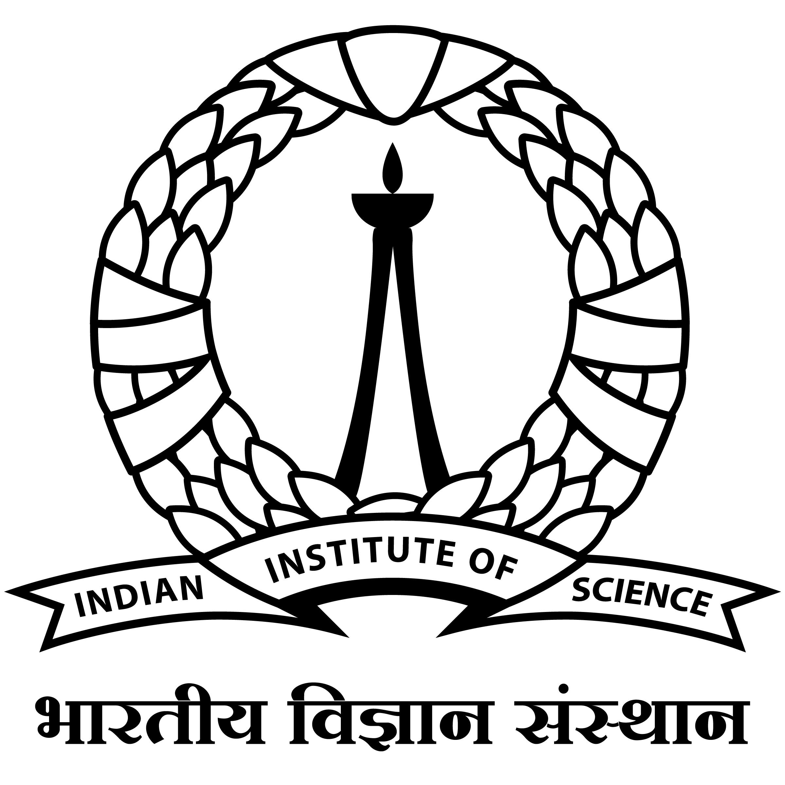

Aspiring Software Engineer/Data Scientist with a deep affinity for Computer Science and Machine Learning. I bring a robust foundation in Mathematics, Computational skills, and Engineering acumen honed during my bachelor's program at the esteemed National Institute of Technology (NIT), Calicut.

Proficient in Algorithms, Machine Learning, Statistics, Probability, Linear Algebra, Calculus, and adept at utilizing programming languages such as C/C++, Python, and SQL. My toolkit includes mastery of data science libraries like Pandas, Scikit-learn, Matplotlib, NumPy, and OpenCV.

I was the recipient of the prestigious [Indian Academy of Sciences (IAS) Fellowship](https://webjapps.ias.ac.in/fellowship2023/lists/selectedList.jsp), awarded to the top 200 students from premier institutes in India across all the Engineering disciplines. 

Last Summer, I worked at the <a href="https://iisc.ac.in" target="_blank">Indian Institute of Science (IISc), Bengaluru</a> at the <a href="https://sites.google.com/view/dashresearchlab/people" target="_blank">Multiscale Transport and Energy Research (MTERL) Lab</a> under the guidance of <a href="https://mecheng.iisc.ac.in/people/susmita-dash/" target="_blank">Dr. Susmita Dash</a>, as an Indian Academy of Sciences Summer Research Fellow.  
<i class="fas fa-envelope email-link" id="emailicon-high">&nbsp;:&nbsp;&nbsp;</i> 
<code style="color: #000000; background: #ffffff; display: inline-block;">vasanthsbhaskara [at] gmail [dot] com</code>

## Education
<table>
  <tbody>
    <tr>
      <td rowspan="3" style="text-align: center; vertical-align: top;"></td>
      <td style="text-align: left; vertical-align: top;"><strong>B.Tech. in Mechanical Engineering</strong></td>
      <td></td>
    </tr>
    <tr>
      <td style="text-align: left; vertical-align: top;"><strong><a href="https://www.nitc.ac.in/">National Institute of Technology (NIT), Calicut</a></strong></td>
      <td>&nbsp;</td>
      <td style="text-align: right; vertical-align: top;">Dec 2020 - June 2024</td>
    </tr>
    <tr>
      <td style="text-align: left; vertical-align: top;">Cumulative Grade Point Average: 9.21 / 10.0</td>
      <td></td>
      <td></td>
    </tr>
  </tbody>
</table>

- Project Title: Design, Fabrication, and Control of a Multipurpose Marine Robot
- Project Advisor: [Dr. Sudheer A P](https://nitc.ac.in/department/mechanical-engineering/faculty-and-staff/faculty/8eb95fa4-0e19-4246-aa46-75095a3ec8d8), Associate Professor, National Institute of Technology (NIT) Calicut
- Funding: Secured a Grant of Rs. 75,000 from the Centre for Innovation, Entrepreneurship and Incubation (CIEI) at NIT Calicut

## Research Experience
<table>
  <tbody>
    <tr>
      <td rowspan="3" style="text-align: center; vertical-align: top;"></td>
      <td style="text-align: left; vertical-align: top;"><strong>Indian Academy of Sciences (IAS), Summer Research Fellow</strong></td>
      <td></td>
    </tr>
    <tr>
      <td style="text-align: left; vertical-align: top;"><strong><a href="https://iisc.ac.in">Indian Institute of Science (IISc), Bengaluru</a></strong></td>
      <td>&nbsp;</td>
      <td style="text-align: right; vertical-align: top;">May 2023 - June 2023</td>
    </tr>
    <tr>
      <td style="text-align: left; vertical-align: top;">Droplet Dynamics on Heated Substrates, Guide: <a href="https://mecheng.iisc.ac.in/people/susmita-dash/" target="_blank">Dr. Susmita Dash</a></td>
      <td></td>
      <td></td>
    </tr>
  </tbody>
</table>

- Conducted experiments involving water droplets on a hot pillared surface and captured dynamics using high-speed cameras
- Conducted image processing in Python using OpenCV on the clip of a Leidenfrost droplet
- Gained proficiency in the principles of image processing algorithms: Gaussian Blur, Canny Detector, Thresholding, and Contouring
- Quantified the effect of an increase in heat transfer from the pillars to the droplet with pillar height, by modelling the system as fins

## Achievements

### Attained a Grade of 9.0 or above in 83% of courses taken at NITC so far (Jan 2024)
- Secured more than 9 points (i.e., S and A grades) in 44 courses of the total 53 courses credited at NIT Calicut

### Secured highest grade in the courses on Machine Learning, Computer Programming, Robotics and Mathematics courses during Bachelor's (Dec 2023)
- Secured highest grade in the courses: "ME4131D: Machine Learning for Data Science and Analytics", "ZZ1004D: Computer Programming", "ME4023D: Introduction To Robotics" and all the Mathematics courses during Bachelor's at NIT Calicut

### Top 3 in the Mechanical Engineering Department after the end of 6th Semester (Nov 2023)
- Standing among the Top 3 in the entire undergraduate class of Mechanical Engineering, consisting of 200+ students, after the conclusion of the 6th semester

### Selected for the Summer Fellowship programs at IIT Madras and IIT Kanpur (May 2023)
- Selected for the IIT Madras Summer Fellowship (SFP) program and the IIT Kanpur SURGE program

### Recipient of the prestigious IASc-INSA-NASI Summer Research Fellowship (Mar 2023)
- Selected for the highly competitive Indian Academy of Sciences Fellowship, one of the most prestigious fellowships in India.
- Worked under Dr. Susmita Dash at the Indian Institute of Science (IISc) Bengaluru as a summer intern

### Secured Highest grade in all the Mathematics Courses taken (May 2022)
- Secured 10 Points in all the Mathematics Courses during Undergraduate studies.
- Was the only student in the department who was awarded 10 points in the Mathematics course taken during my 4th Semester BTech.

### Department Rank 1 in 4th Semester at NIT Calicut (June 2022)
- Secured highest SGPA of 9.58 / 10.0 among 210 students in the Mechanical Engineering Department at NIT Calicut

### Ranked in the Top 20 among 1256 first-year undergraduates at NIT Calicut, Was Eligible for Branch Change (Aug 2021)
- Ranked among top 20 first-year undergraduate students across all departments at NITC and was granted the option of branch change due to my outstanding academic performance in my first year of undergraduate studies

## Projects

### Top 3 teams among the class in the Kaggle Insurance Claim Challenge (Dec 2023)
Mentor: Dr. Saketha Athkuri
- Successfully tackled Insurance Claim Prediction claim predictions with 73% Challenge, employing XGBoost for accurate claim predictions with 73% accuracy
- Demonstrated expertise in Data Preprocessing, Feature Engineering and Machine Learning

### Monté Carlo Simulation to estimate the real fuel cell efficiency (April 2023)
Mentor: Dr. Deepak Lawrence K
- Conducted Monté Carlo simulation in Python to estimate the real efficiency of a fuel cell when the distribution of each variable is known.

### Optimization of Transportation Logistics at NIT Calicut (March 2023)
Mentor: Dr. Sajan T John
- Applied linear programming techniques to solve a transportation problem involving two warehouses and six hostels. Achieved cost-effective allocation by strategically assigning warehouses to hostels using Excel solver.

## Relevant Coursework

### Courses with Perfect Grade
- Computer Programming, Machine Learning for Data Science and Analytics, Introduction to Robotics

### Online Courses
- Machine Learning offered by Andrew Ng (Coursera), CS50: Introduction to Computer Science (edX)

## Skills

- Tech Stack: Data Structures and Algorithms (Proficient), SQL (Beginner)
- Languages: Python (Proficient), C/C++ (Intermediate)
- Python Libraries: NumPy, Pandas, Scikit- learn, OpenCV, Matplotlib 
- Scientific: Jupyter Notebook, VS Code, Sublime Text